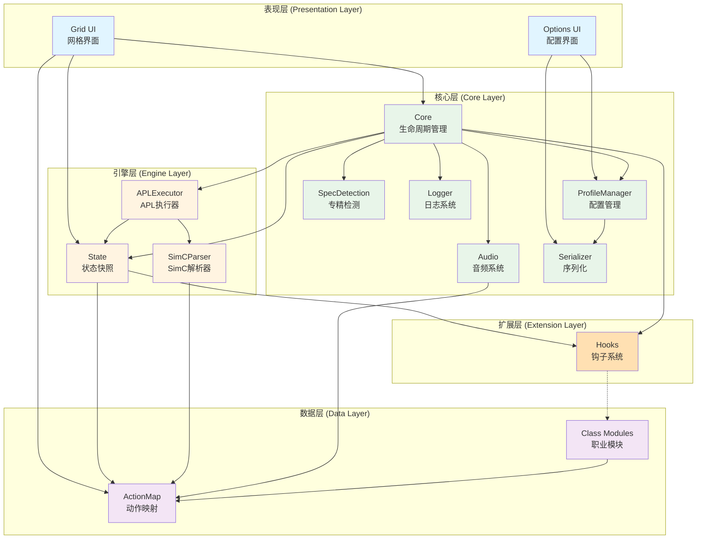
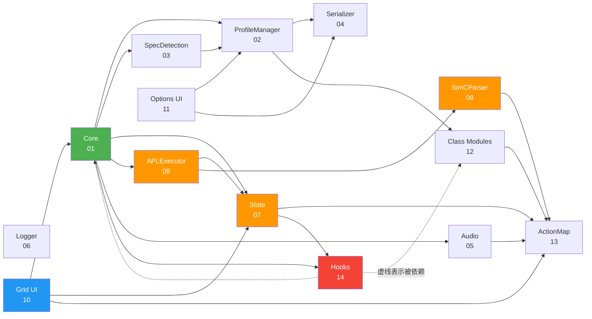
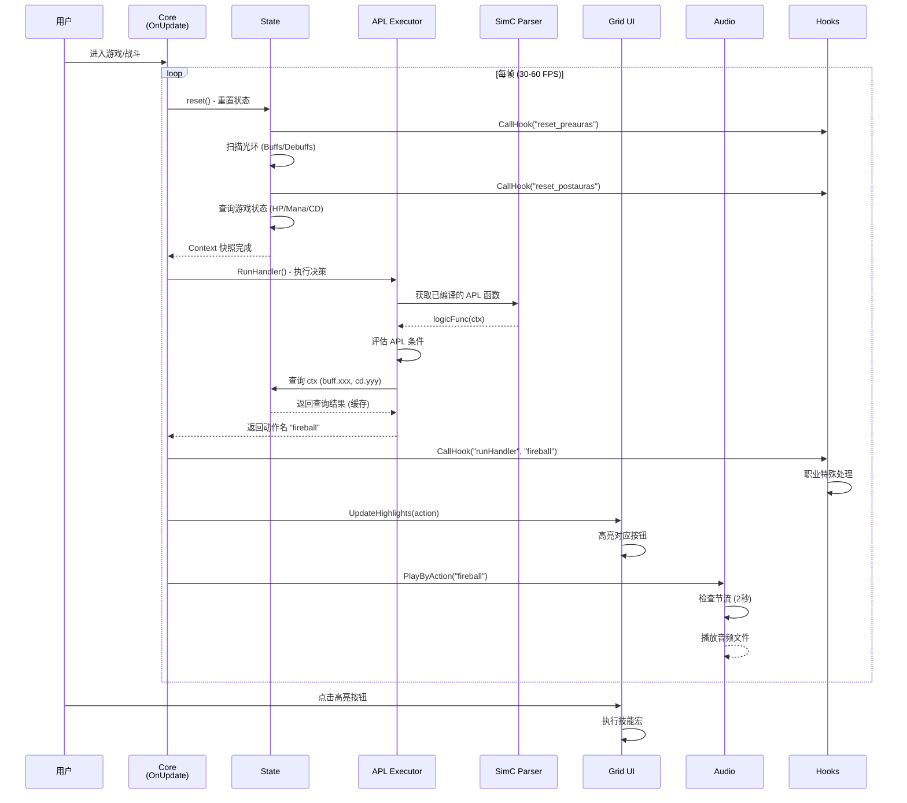
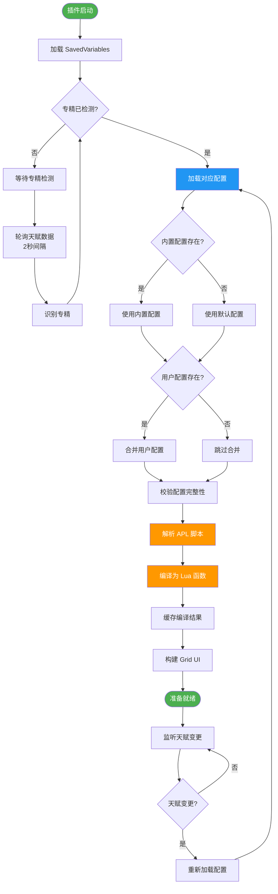
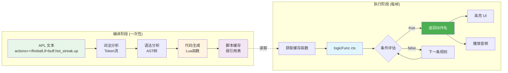
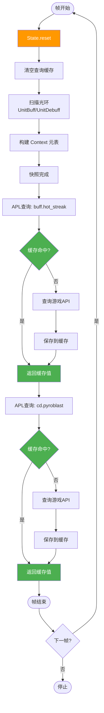
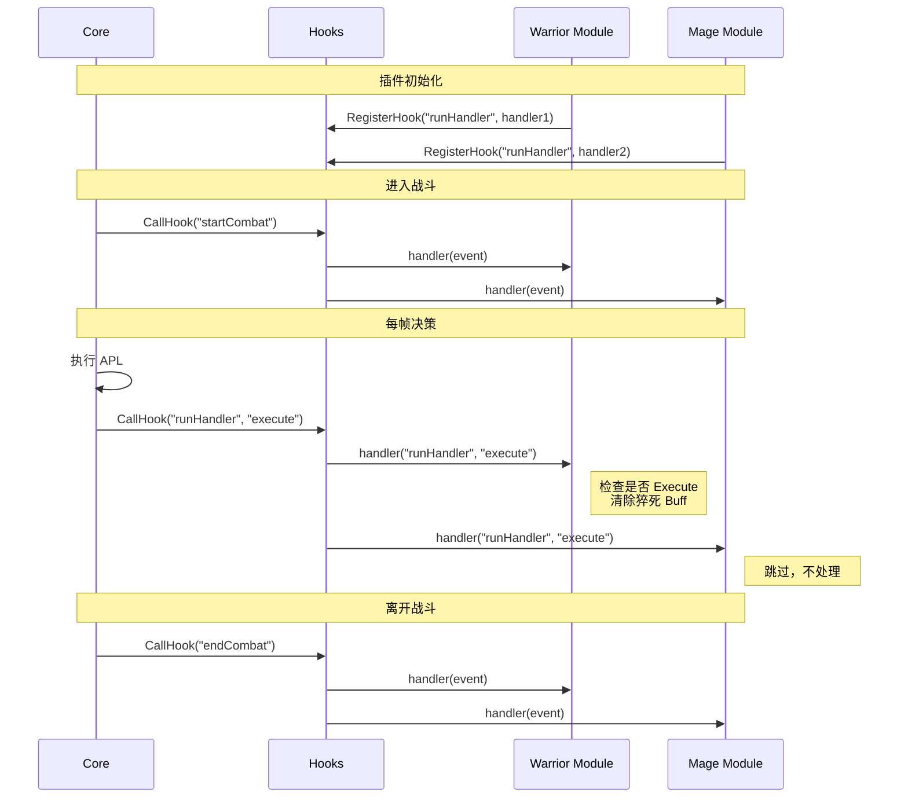
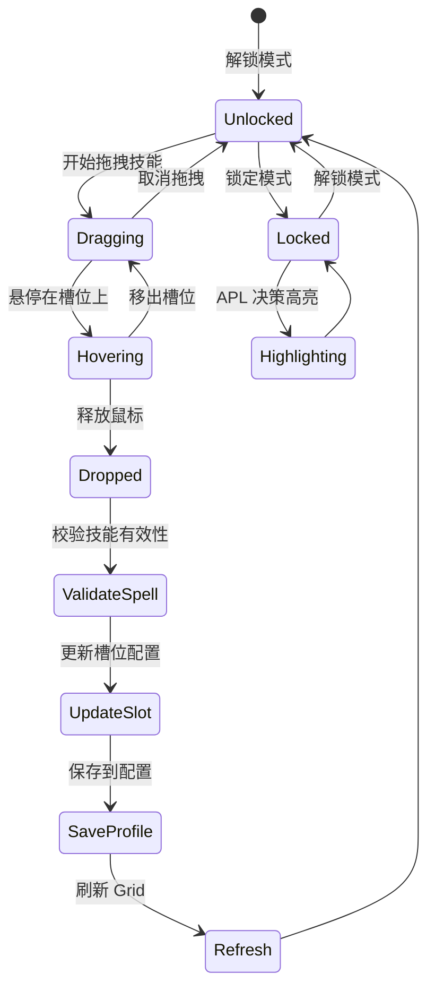
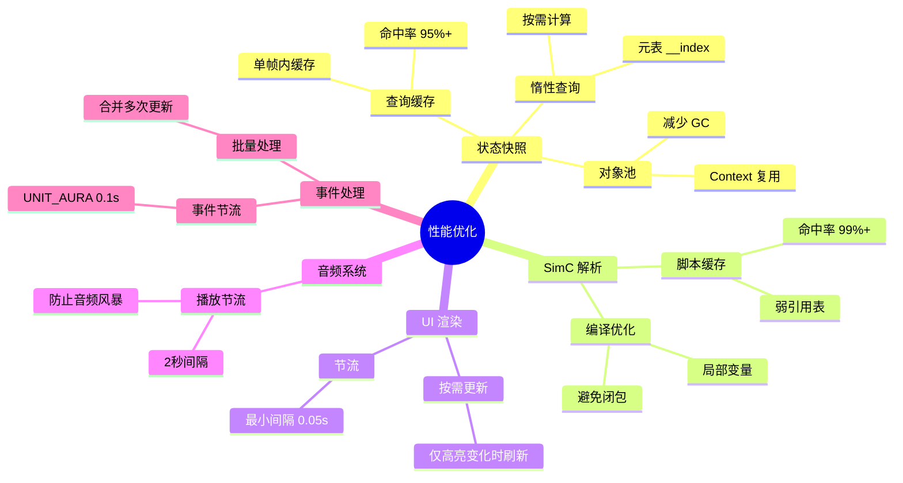
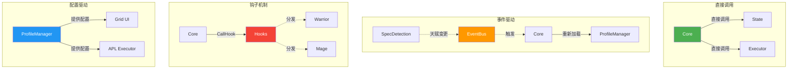

# WhackAMole 架构图与流程图

本文档包含 WhackAMole 系统的各类架构图和流程图，帮助理解系统整体结构和运行机制。

---

## 1. 系统分层架构

---

## 2. 模块依赖关系图

---

## 3. 技能决策完整流程

---

## 4. 配置加载与切换流程

---

## 5. APL 编译与执行流程

---

## 6. 状态快照与查询缓存机制

---

## 7. 钩子系统事件流

---

## 8. Grid UI 拖拽绑定流程

---

## 9. 性能优化关键点

---

## 10. 模块通信模式

---

## 图表说明

### Mermaid 渲染
所有图表使用 Mermaid 语法编写，可在以下环境中正确渲染：
- GitHub (原生支持)
- VS Code (Markdown Preview Mermaid Support 插件)
- 在线工具 (https://mermaid.live)

### 图例

| 颜色 | 含义 |
|------|------|
| 🟢 绿色 | 核心层模块 |
| 🟠 橙色 | 引擎层模块 |
| 🔵 蓝色 | 表现层模块 |
| 🟣 紫色 | 数据层模块 |
| 🔴 红色 | 扩展层模块 |

| 线条 | 含义 |
|------|------|
| 实线箭头 | 直接依赖 |
| 虚线箭头 | 被动依赖/事件触发 |
| 双向箭头 | 相互通信 |

---

## 相关文档

- [主设计文档](../WhackAMole_Design.md) - 系统概览
- [详细设计索引](INDEX.md) - 14 个模块详细设计
- [阅读指南](README.md) - 推荐阅读路径
